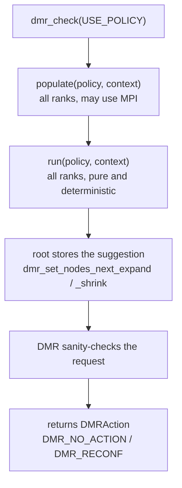

A **policy** decides, on every iteration, whether the job should grow, shrink, or stay at its current size. In DMR a policy is a plain C object (`DMRPolicy`) that you register once with `dmr_set_policy`, and that DMR evaluates whenever you call `dmr_check(USE_POLICY)`.

```c
#include "dmr.h"
#include "dmr_test_policies.h"

dmr_set_policy(dmr_get_policy_round());   /* collective, all ranks must call */

while (should_keep_running()) {
    DMR_AUTO(dmr_check(USE_POLICY), save(), (void)NULL, cleanup());
    do_work();
}
```

:::info[Changed in 3.0.0]
Policies used to be fixed enum values passed to `dmr_check` (`ROUND_POLICY`, `CE_POLICY`, …). They are now pluggable objects: you pass `USE_POLICY` and DMR dispatches to whatever policy you registered. See [Migrating from 2.x](#migrating-from-2x).
:::

## DMRSuggestion values

```c
DMRAction action = dmr_check(USE_POLICY);
```

| Value | Description |
|-------|-------------|
| `USE_POLICY` | Evaluate the policy registered with `dmr_set_policy` |
| `SHOULD_EXPAND` | Manual: expand by `dmr_set_nodes_next_expand()` nodes |
| `SHOULD_SHRINK` | Manual: shrink by `dmr_set_nodes_next_shrink()` nodes |
| `SHOULD_STAY` | Manual: do not reconfigure this iteration |

If no policy has been registered (or you passed `NULL`), `dmr_check(USE_POLICY)` always resolves to `SHOULD_STAY`.

## How an evaluation works

Each `dmr_check(USE_POLICY)` runs two callbacks of the active policy, in order:

1. **`populate(policy, context)`** gathers the external information the policy needs (TALP metrics, cluster state, …). It runs on **every rank**, because some of that work is an MPI collective. It may be `NULL` if the policy needs no external data.
2. **`run(policy, context)`** is the pure decision. Given the context, it returns a `DMRPolicySuggestion`: stay, expand by N nodes, or shrink by N nodes.



Every rank evaluates `run` and computes the same suggestion independently: DMR does **not** broadcast the decision, so `run` must be deterministic for a given context. Only rank 0 actually stores the result, through the root-only sizing setters. Non-root ranks learn the outcome later, through the normal intercommunicator merge once root has driven the Slurm request.

## What DMR enforces, and what it does not

DMR does not own any node-count limits. A minimum or maximum is **policy state**: each policy resolves it in its own constructor and applies it in `run`.

What DMR checks before acting on a suggestion is only whether the request makes sense at all:

| Operation | Rejected when |
|-----------|---------------|
| Expand | The request adds zero (or fewer) nodes, or zero (or fewer) processes |
| Shrink | It removes nothing, a negative amount, or every node or process the job is running on |

A rejected suggestion makes `dmr_check` return `DMR_NO_ACTION`. A request that is merely large is passed on to Slurm, which is the component that decides whether it can be served.

## Configuring policies

Built-in policies read their parameters from the environment **inside their constructor**, and store them in their own state:

```bash
DMR_DEFAULT_POLICY_MIN=2 DMR_DEFAULT_POLICY_MAX=16 dmr mpirun -n 2 ./my_app
```

Because the values are read when the constructor runs, changing a parameter at runtime means calling the constructor again before the next `dmr_check`:

```c
setenv("DMR_DEFAULT_POLICY_STRIDE", "4", 1);
dmr_set_policy(dmr_get_policy_round());   /* picks up the new stride */
```

There are no `dmr_set_policy_*` runtime setters any more. If you want first-class parameters instead of environment variables, write a [custom policy](custom-policies) and keep them in its state.

Each built-in policy's accepted parameters are listed in [Built-in Policies](dmr-policies).

## Manual control

Passing `SHOULD_EXPAND` or `SHOULD_SHRINK` bypasses the policy system entirely and lets the application decide reconfiguration timing itself:

```c
if (my_app_needs_more_resources()) {
    dmr_set_nodes_next_expand(4);
    DMR_AUTO(dmr_check(SHOULD_EXPAND), save_data(), (void)NULL, cleanup());
}
```

See [Manual Control](manual-control) for the full set of sizing and cancellation calls.

## Inhibitor

Throttle how often DMR attempts a reconfiguration, regardless of what the policy suggests. If the inhibitor is `N`, then `N` out of every `N+1` calls to `dmr_check` are skipped:

```c
dmr_set_reconf_step_inhibitor(9);  // reconfigure on every 10th call
```

Or at compile/run time: `DMR_DEFAULT_INHIBITOR=9`.

## Migrating from 2.x

| 2.x | 3.0.0 |
|-----|-------|
| `dmr_check(ROUND_POLICY)` | `dmr_set_policy(dmr_get_policy_round())` once, then `dmr_check(USE_POLICY)` |
| `dmr_check(LIST_POLICY)` | `dmr_set_policy(dmr_get_policy_list())`, then `dmr_check(USE_POLICY)` |
| `dmr_check(CE_POLICY)` | `dmr_set_policy(dmr_get_policy_ce())`, then `dmr_check(USE_POLICY)` |
| `dmr_check(SLURM4DMR_ROUND_POLICY)` | `dmr_get_policy_round()`, since the built-ins are mode-agnostic now |
| `dmr_check(SLURM4DMR_CE_POLICY)` | `dmr_get_policy_ce()` |
| `dmr_check(SLURM4DMR_QUEUE_POLICY)` | Removed. Implement it as a [custom policy](custom-policies) |
| `dmr_set_policy_min_nodes(n)` | `DMR_DEFAULT_POLICY_MIN=n` in the environment, or custom policy state |
| `dmr_set_policy_max_nodes(n)` | `DMR_DEFAULT_POLICY_MAX=n` in the environment, or custom policy state |
| `dmr_set_policy_stride(n)` | `DMR_DEFAULT_POLICY_STRIDE=n` in the environment, or custom policy state |
| `dmr_set_policy_pref_nodes(n)` | Removed along with `DMR_DEFAULT_POLICY_PREF` |

Manual control (`SHOULD_EXPAND`, `SHOULD_SHRINK`, `SHOULD_STAY`) and every `dmr_set_*_next_*` sizing call are unchanged.
