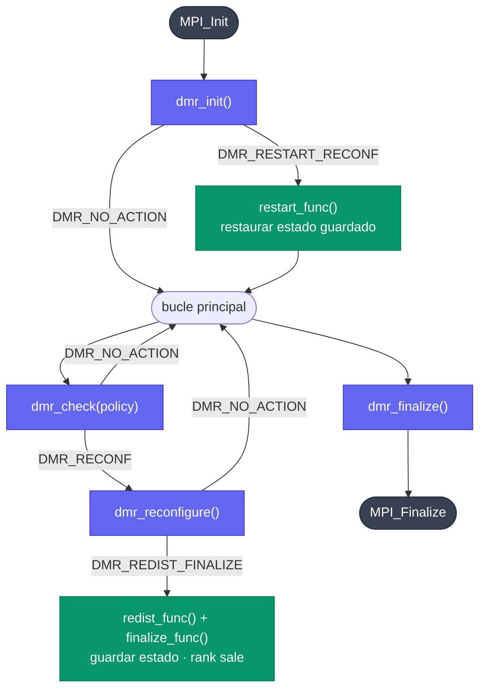

Una aplicación DMR se construye alrededor de tres funciones del ciclo de vida y un bucle principal. El concepto central es que DMR devuelve un valor `DMRAction` indicando qué hacer a continuación, y `DMR_AUTO` se encarga del despacho automáticamente.

## Cómo funcionan las reconfiguraciones

Esto es lo más importante que debes entender antes de escribir una aplicación DMR.

Cuando ocurre una reconfiguración, los procesos actuales salen y el **wrapper relanza el ejecutable desde el principio** con el nuevo número de procesos. Esto significa que `main()` se vuelve a llamar desde cero y todas las variables locales se reinician.

Si tu aplicación tiene un bucle que lleva el progreso con una variable local, esa variable siempre volverá a cero después de reiniciar:

```c
// INCORRECTO: bucle infinito
int main(int argc, char *argv[]) {

    // <-- después de cada reconfiguración, la ejecución vuelve a empezar aquí
    MPI_Init(&argc, &argv);
    DMR_AUTO(dmr_init(argc, argv), (void)NULL, (void)NULL, (void)NULL);

    for (int i = 0; i < 10; i++) {  // i siempre vale 0 tras el reinicio
        DMR_AUTO(dmr_check(SHOULD_EXPAND), save(), (void)NULL, (void)NULL);
        do_work(i);
    }
    // nunca se alcanza
}
```

Debes **persistir en disco cualquier estado que tenga que sobrevivir a una reconfiguración** y restaurarlo en `restart_func`:

```c
// CORRECTO: guarda i antes de salir y restáurala al reiniciar
typedef struct { int i; } AppState;

void save_state(void) {
    AppState s = { .i = current_i };
    FILE *f = fopen("checkpoint.bin", "wb");
    fwrite(&s, sizeof(s), 1, f);
    fclose(f);
}

void load_state(void) {
    AppState s;
    FILE *f = fopen("checkpoint.bin", "rb");
    fread(&s, sizeof(s), 1, f);
    fclose(f);
    current_i = s.i;
}

int current_i = 0;

int main(int argc, char *argv[]) {
    MPI_Init(&argc, &argv);
    DMR_AUTO(dmr_init(argc, argv), (void)NULL, load_state(), (void)NULL);

    while (current_i < 10) {
        DMR_AUTO(dmr_check(SHOULD_EXPAND), save_state(), (void)NULL, (void)NULL);
        do_work(current_i);
        current_i++;
    }
    ...
}
```

El condicional del bucle usa `current_i` - una global que se conserva gracias al checkpoint - y no una `i` local. Tras el reinicio, `load_state()` la restaura al punto en que se quedó la ejecución anterior.

## Resumen del ciclo de vida



- **Morado**: llamadas de la biblioteca DMR
- **Verde**: callbacks que implementas tú
- **Oscuro**: MPI

## Bucle principal típico

```c
#include <mpi.h>
#include "dmr.h"

static void save_checkpoint(void)  { /* persistir el estado en disco */ }
static void load_checkpoint(void)  { /* leer los datos escritos por la configuración anterior */ }
static void cleanup(void)          { /* liberar recursos */ }

int main(int argc, char *argv[])
{
    MPI_Init(&argc, &argv);

    /* dmr_init puede devolver DMR_RESTART_RECONF si este proceso se ha lanzado
       como parte de una expansión; load_checkpoint() cubre ese caso. */
    DMR_AUTO(dmr_init(argc, argv), (void)NULL, load_checkpoint(), cleanup());

    dmr_set_policy_min_nodes(2);
    dmr_set_policy_max_nodes(8);

    while (should_keep_running()) {
        DMR_AUTO(dmr_check(ROUND_POLICY), save_checkpoint(), (void)NULL, cleanup());
        do_work();
    }

    DMR_AUTO(dmr_finalize(), (void)NULL, (void)NULL, cleanup());
    MPI_Finalize();
    return 0;
}
```

## dmr_init

Llama a `dmr_init` inmediatamente después de `MPI_Init`. **Colectiva.**

Devuelve `DMR_NO_ACTION` en el primer lanzamiento, o `DMR_RESTART_RECONF` cuando el ejecutable se ha reiniciado después de una reconfiguración, consulta [Cómo funcionan las reconfiguraciones](#cómo-funcionan-las-reconfiguraciones) más arriba. `DMR_AUTO` invoca `restart_func` en el segundo caso.

## dmr_check

Llama a `dmr_check` dentro del bucle principal con un `DMRSuggestion`. **Colectiva.**

Cuando DMR decide reconfigurar devuelve `DMR_RECONF`. `DMR_AUTO` llama entonces internamente a `dmr_reconfigure()`, que se encarga de preparar el comunicador MPI. Los procesos que salen reciben `DMR_REDIST_FINALIZE` de `dmr_reconfigure()`; `DMR_AUTO` llama a `redist_func` y `finalize_func` en ellos y termina esos ranks.

## dmr_reconfigure

La llama automáticamente `DMR_AUTO` cuando se devuelve `DMR_RECONF`. No la llames manualmente salvo que gestiones tú mismo los valores `DMRAction`.

## dmr_finalize

Llama a `dmr_finalize` antes de `MPI_Finalize`. No es colectiva, pero una vez que un rank la llama ya no puede hacer más llamadas a DMR desde ese rank.

## Comunicador y checkpoint-restart

DMR admite dos estrategias de redistribución, seleccionadas en tiempo de compilación:

| Estrategia | `DMR_CHECKPOINT_RESTART` | Cómo funciona |
|----------|--------------------------|--------------|
| **Checkpoint-restart** (predeterminada) | `1` | Los procesos antiguos guardan el estado en disco y salen; los procesos nuevos arrancan desde el principio del ejecutable y restauran el estado mediante `restart_func` |
| **Intercomunicador** | `0` | Los procesos antiguos y los nuevos están vivos al mismo tiempo; intercambian datos directamente mediante `DMR_INTERCOMM` y luego los antiguos salen. Los nuevos también arrancan desde el principio del ejecutable. |

Consulta [Redistribución de datos](data-redistribution) para ver una explicación detallada del flujo con `DMR_CHECKPOINT_RESTART=0`.

## Seguridad con múltiples hilos

DMR **no es thread-safe**. No llames a ninguna función de DMR desde varios hilos al mismo tiempo.
